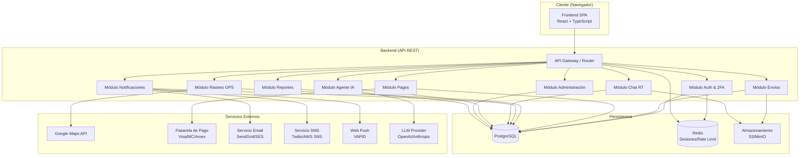
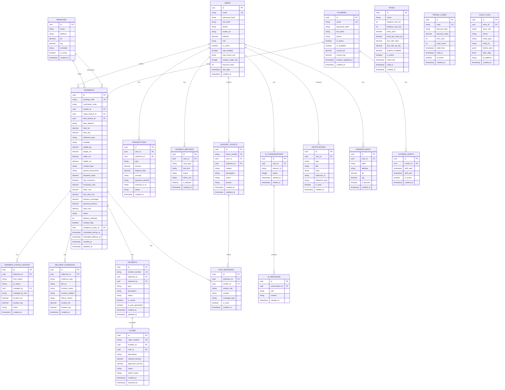
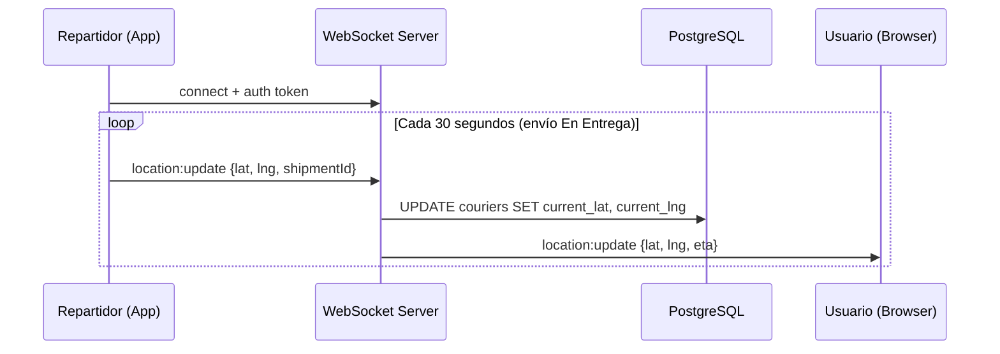
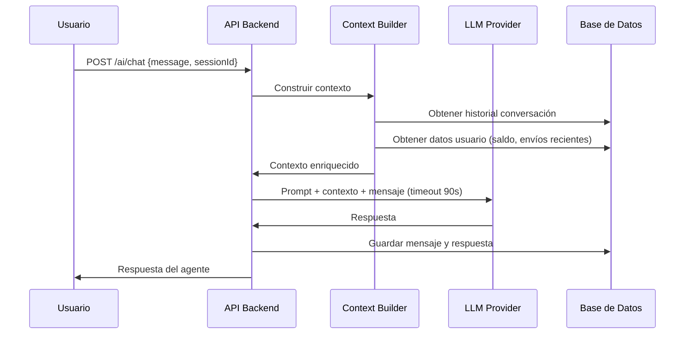

# Diseño Técnico - Sistema Logístico de Paquetería STN PQ's

## Resumen

Este documento describe el diseño técnico del Sistema Logístico de Paquetería STN PQ's, una aplicación web que permite gestionar envíos de paquetes, rastreo GPS en tiempo real, pagos, notificaciones multicanal y un agente IA conversacional. El sistema opera en Argentina y se basa en la red de sucursales del Correo Argentino.

---

## Arquitectura

### Visión General

El sistema sigue una arquitectura de tres capas con separación clara entre frontend, backend y base de datos. Se complementa con servicios externos para pagos, mapas, notificaciones y el agente IA.



### Decisiones Técnicas Clave

| Decisión | Elección | Justificación |
|---|---|---|
| Frontend | React + TypeScript | Ecosistema maduro, tipado estático, componentes reutilizables |
| Backend | Node.js + Express (TypeScript) | Mismo lenguaje full-stack, alto rendimiento I/O, WebSockets nativos |
| Base de datos | PostgreSQL | Transacciones ACID para pagos, soporte geoespacial (PostGIS), JSON nativo |
| Cache / Rate Limit | Redis | TTL nativo para sesiones, contadores atómicos para rate limiting |
| Chat en tiempo real | WebSockets (Socket.io) | Bidireccional, reconexión automática, rooms por envío |
| GPS en tiempo real | WebSockets (mismo canal) | Evita polling, latencia baja para actualizaciones cada 30s |
| Almacenamiento archivos | S3-compatible (MinIO) | Fotos de evidencia, firmas digitales, documentos |
| Agente IA | LLM vía API (OpenAI/Anthropic) | Procesamiento de lenguaje natural en español, sin entrenamiento propio |
| Autenticación | JWT + Refresh Tokens | Stateless, compatible con 2FA, invalidación via Redis |
| Encriptación | bcrypt (passwords), AES-256 (datos sensibles) | Estándares de la industria |

---

## Componentes e Interfaces

### Módulos del Backend

#### 1. Módulo Auth & 2FA
Responsabilidades: registro, login, 2FA (TOTP), recuperación de contraseña, gestión de sesiones, timeout automático.

Endpoints principales:
- `POST /auth/register` — Registro de usuario
- `POST /auth/login` — Inicio de sesión
- `POST /auth/2fa/setup` — Configurar 2FA (genera QR)
- `POST /auth/2fa/verify` — Verificar código TOTP
- `POST /auth/logout` — Cerrar sesión (invalida token)
- `POST /auth/password/reset-request` — Solicitar recuperación
- `POST /auth/password/reset` — Establecer nueva contraseña
- `POST /auth/token/refresh` — Renovar access token

#### 2. Módulo Envíos
Responsabilidades: creación, cotización, ciclo de vida de estados, validaciones, códigos de seguimiento y verificación.

Endpoints principales:
- `POST /shipments` — Crear envío
- `GET /shipments` — Listar envíos del usuario autenticado
- `GET /shipments/:trackingCode` — Detalle por código de seguimiento
- `PATCH /shipments/:id/status` — Actualizar estado (repartidor/admin)
- `POST /shipments/quote` — Cotización sin autenticación
- `POST /shipments/:id/cancel` — Cancelar envío
- `POST /shipments/:id/delivery/confirm` — Confirmar entrega con evidencias
- `POST /shipments/:id/delivery/fail` — Registrar entrega fallida

#### 3. Módulo Pagos
Responsabilidades: recarga de saldo, procesamiento con pasarela, generación de recibos, historial de transacciones.

Endpoints principales:
- `POST /payments/topup` — Agregar fondos
- `GET /payments/transactions` — Historial de transacciones
- `GET /payments/receipts/:id` — Descargar recibo
- `POST /payments/methods` — Guardar método de pago
- `GET /payments/methods` — Listar métodos guardados

#### 4. Módulo Rastreo GPS
Responsabilidades: recepción de coordenadas del repartidor, cálculo de ETA, integración con Google Maps.

Endpoints principales:
- `POST /tracking/location` — Repartidor envía su ubicación (también via WebSocket)
- `GET /tracking/:shipmentId/live` — Ubicación actual del repartidor para un envío
- `GET /tracking/:shipmentId/history` — Historial de estados con ubicaciones

#### 5. Módulo Notificaciones
Responsabilidades: envío de email, SMS y push; gestión del centro de notificaciones in-app.

Endpoints principales:
- `GET /notifications` — Centro de notificaciones del usuario
- `PATCH /notifications/:id/read` — Marcar como leída
- `PATCH /notifications/read-all` — Marcar todas como leídas
- `PUT /notifications/preferences` — Configurar preferencias

#### 6. Módulo Chat en Tiempo Real
Responsabilidades: canales usuario-repartidor por envío, apertura/cierre automático, historial.

WebSocket events:
- `chat:join` — Unirse al canal de un envío
- `chat:message` — Enviar mensaje
- `chat:typing` — Indicador de escritura
- `chat:history` — Solicitar historial

REST endpoints:
- `GET /chat/:shipmentId/messages` — Historial de mensajes

#### 7. Módulo Agente IA
Responsabilidades: conversación en español, consultas de envíos, acciones desde el chat, escalamiento a humano.

Endpoints principales:
- `POST /ai/chat` — Enviar mensaje al agente (timeout: 90s)
- `GET /ai/chat/history` — Historial de conversaciones
- `POST /ai/chat/:sessionId/rate` — Calificar atención

#### 8. Módulo Administración
Responsabilidades: gestión de usuarios, repartidores, sucursales, servicios, tarifas, códigos promocionales, asignación de envíos.

Endpoints principales (prefijo `/admin`):
- `GET /admin/shipments` — Buscar todos los envíos
- `PATCH /admin/shipments/:id` — Modificar envío
- `GET /admin/users` — Listar usuarios
- `PATCH /admin/users/:id` — Modificar usuario/saldo
- `POST /admin/branches` — Crear sucursal
- `POST /admin/couriers` — Registrar repartidor
- `POST /admin/rates` — Crear/modificar tarifas
- `POST /admin/promo-codes` — Crear código promocional
- `POST /admin/shipments/:id/assign` — Asignar repartidor
- `GET /admin/audit-logs` — Ver logs de auditoría

#### 9. Módulo Reportes
Responsabilidades: dashboard de métricas, reportes financieros, desempeño de repartidores, exportación.

Endpoints principales:
- `GET /reports/dashboard` — Métricas en tiempo real
- `GET /reports/financial` — Reporte financiero
- `GET /reports/couriers/:id/performance` — Desempeño de repartidor
- `GET /reports/export/shipments` — Exportar envíos (CSV/Excel)
- `GET /reports/export/financial` — Exportar financiero (PDF/Excel)

### Frontend — Vistas Principales

| Vista | Roles | Descripción |
|---|---|---|
| Landing / Cotizador público | Visitante | Cotización sin registro, info de servicios, FAQ |
| Login / Registro / 2FA | Todos | Autenticación |
| Panel Usuario | Usuario | Envíos activos, saldo, notificaciones, agente IA |
| Crear Envío | Usuario | Formulario multi-paso con cotización en tiempo real |
| Seguimiento | Usuario | Mapa, estados, chat, GPS en vivo |
| Estado de Cuenta | Usuario | Transacciones, recibos, recarga de saldo |
| Panel Repartidor | Repartidor | Envíos asignados, ruta optimizada, actualización de estado |
| Panel Admin | Administrador | Dashboard, gestión completa, reportes, logs |

---

## Modelos de Datos

### Diagrama Entidad-Relación (simplificado)



---

## Lógica de Cotización y Tarifas

### Fórmula Haversine

La distancia entre dos puntos GPS se calcula con la fórmula Haversine:

```
a = sin²(Δlat/2) + cos(lat1) × cos(lat2) × sin²(Δlng/2)
c = 2 × atan2(√a, √(1−a))
distancia = R × c   (R = 6.371 km)
```

### Peso Efectivo

```
peso_volumetrico = (largo × ancho × alto) / 5000
peso_efectivo = max(peso_real, peso_volumetrico)
```

### Cálculo de Tarifa S2S (Sucursal a Sucursal)

```
distancia = haversine(origen.lat, origen.lng, destino.lat, destino.lng)

si distancia <= 100 km:
    costo = 500 + max(0, peso_efectivo - 1) × 80
si 101 <= distancia <= 500 km:
    costo = 1200 + max(0, peso_efectivo - 1) × 150
si 501 <= distancia <= 1000 km:
    costo = 2500 + max(0, peso_efectivo - 1) × 250
si distancia > 1000 km:
    costo = 4500 + max(0, peso_efectivo - 1) × 400

si modalidad == Express:
    costo = costo × 1.40
```

### Cálculo de Tarifa S2D (Sucursal a Domicilio)

```
sucursal_cercana = argmin(haversine(domicilio, s) para s en sucursales_activas)
distancia_s2s = haversine(origen, sucursal_cercana)
costo_tramo = calcular_tarifa_s2s(distancia_s2s, peso_efectivo, modalidad)

costo_ultima_milla = 1500 + max(0, peso_efectivo - 1) × 200

costo_total = costo_tramo + costo_ultima_milla
```

### Descuentos por Volumen

```
envios_ultimo_mes = count(envios del usuario en los últimos 30 días)

si envios_ultimo_mes >= 100: descuento = 15%
si envios_ultimo_mes >= 50:  descuento = 10%
si envios_ultimo_mes >= 10:  descuento = 5%
si envios_ultimo_mes < 10:   descuento = 0%
```

---

## Seguridad

### Autenticación y Sesiones

- JWT con expiración de 15 minutos (access token) + refresh token de 7 días almacenado en cookie HttpOnly
- 2FA con TOTP (RFC 6238) usando librerías como `speakeasy`; secreto encriptado con AES-256 en base de datos
- Timeout de sesión: 30 min usuarios, 15 min administradores; advertencia a los 2 minutos previos via WebSocket
- Invalidación de tokens en Redis al hacer logout o detectar actividad sospechosa

### Encriptación

- Contraseñas: bcrypt con factor de costo 12
- Datos de tarjetas: AES-256-GCM, solo se almacena el token de la pasarela (nunca el PAN completo)
- Datos personales sensibles: AES-256-GCM con clave maestra en variable de entorno / KMS
- Comunicaciones: TLS 1.2+ obligatorio (HTTPS)

### Rate Limiting (Redis)

| Endpoint | Límite | Ventana | Bloqueo |
|---|---|---|---|
| `POST /auth/login` | 5 intentos | 1 minuto por IP | 15 minutos |
| `POST /auth/2fa/verify` | 5 intentos | 1 minuto por usuario | 15 minutos |
| Cualquier endpoint autenticado | 100 req | 1 minuto por usuario | — |
| `POST /shipments/quote` (sin auth) | 10 req | 1 hora por IP | — |

### Logs de Auditoría

Toda acción crítica genera una entrada en `audit_logs` con: actor, rol, acción, entidad afectada, datos antes/después, IP y timestamp. Retención mínima: 12 meses.

---

## Módulo GPS y Mapas

### Flujo de Actualización de Ubicación



### Cálculo de ETA

El ETA se calcula usando la distancia Haversine entre la posición actual del repartidor y el destino, dividida por una velocidad promedio configurable (default: 30 km/h en zona urbana). Se actualiza con cada actualización de ubicación.

### Validación de Geolocalización para Entrega Fallida

Antes de permitir marcar un envío como "Entrega_Fallida", el sistema verifica:
```
distancia = haversine(repartidor.lat, repartidor.lng, envio.dest_lat, envio.dest_lng)
si distancia > 0.2 km: rechazar acción
```

---

## Módulo Agente IA

### Arquitectura del Agente



### Capacidades del Agente

El agente puede ejecutar las siguientes acciones mediante function calling:
- `get_shipment_status(tracking_code)` — Consultar estado de envío
- `get_user_balance()` — Consultar saldo
- `get_shipment_history(limit)` — Historial de pedidos
- `create_incident(shipment_id, type, description)` — Reportar incidencia
- `initiate_claim(incident_id, description, amount)` — Iniciar reclamación
- `cancel_shipment(shipment_id)` — Cancelar envío (con validación de estado)
- `get_refund_policy()` — Política de reembolsos
- `escalate_to_human(reason)` — Escalar a agente humano

### Prompt del Sistema

El agente opera con un system prompt en español que incluye:
- Rol: asistente de logística de STN PQ's
- Idioma: exclusivamente español
- Restricciones: solo información del usuario autenticado
- Instrucciones de escalamiento cuando no puede resolver

---

## Módulo de Notificaciones

### Canales y Eventos

| Evento | Email | Push | SMS | In-App |
|---|---|---|---|---|
| Envío creado | ✓ | ✓ | — | ✓ |
| Cambio de estado | ✓ | ✓ | — | ✓ |
| En Entrega | ✓ | ✓ | ✓ | ✓ |
| Entregado | ✓ | ✓ | ✓ | ✓ |
| Entrega Fallida | ✓ | ✓ | ✓ | ✓ |
| Devuelto a Sucursal | ✓ | ✓ | ✓ | ✓ |
| Pago exitoso | ✓ | — | — | ✓ |
| Ticket respondido | ✓ | ✓ | — | ✓ |
| Recordatorio envío programado | ✓ | ✓ | — | ✓ |
| Nuevo nivel de descuento | ✓ | — | — | ✓ |
| Incidencia crítica (admin) | ✓ | ✓ | — | ✓ |

### Arquitectura de Notificaciones

Las notificaciones se procesan de forma asíncrona mediante una cola de trabajos (Bull/BullMQ sobre Redis) para evitar bloquear las respuestas de la API. Cada notificación se persiste en la tabla `notifications` antes de enviarse por los canales externos.

---

## Manejo de Errores

### Códigos de Error HTTP

| Código | Uso |
|---|---|
| 400 | Validación de entrada fallida |
| 401 | No autenticado |
| 403 | Sin permisos para la acción |
| 404 | Recurso no encontrado |
| 409 | Conflicto (ej: email duplicado, transición de estado inválida) |
| 422 | Entidad no procesable (ej: saldo insuficiente, estado no permite cancelación) |
| 429 | Rate limit excedido |
| 500 | Error interno del servidor |
| 503 | Servicio externo no disponible |

### Estrategias de Resiliencia

- **Pagos**: Si la pasarela falla, el saldo no se modifica. Se registra el intento fallido y se notifica al usuario.
- **Notificaciones**: Reintentos automáticos con backoff exponencial (3 intentos). Si falla, se registra en logs pero no bloquea el flujo principal.
- **Agente IA**: Timeout de 90 segundos. Si el LLM no responde, se devuelve mensaje de error amigable y se escala a humano.
- **GPS**: Si el repartidor pierde conexión, se muestra la última ubicación conocida con indicador de "última actualización hace X minutos".
- **Transacciones de base de datos**: Todas las operaciones que involucran saldo usan transacciones ACID para garantizar consistencia.

### Validaciones de Negocio

- Transiciones de estado inválidas retornan 409 con el mensaje "Transición de estado no permitida: {from} → {to}"
- Saldo insuficiente retorna 422 con saldo actual y costo del envío
- Entrega fallida fuera de rango retorna 403 con distancia actual y distancia máxima permitida
- Código de verificación incorrecto retorna 401 con número de intentos restantes


---

## Propiedades de Corrección

*Una propiedad es una característica o comportamiento que debe mantenerse verdadero en todas las ejecuciones válidas del sistema — esencialmente, una declaración formal sobre lo que el sistema debe hacer. Las propiedades sirven como puente entre las especificaciones legibles por humanos y las garantías de corrección verificables por máquinas.*

---

### Propiedad 1: Autenticación redirige según rol

*Para cualquier* usuario registrado con credenciales válidas, el resultado de la autenticación debe redirigir al panel correspondiente a su rol (usuario → panel de usuario, administrador → panel de administración, repartidor → panel de repartidor).

**Valida: Requerimientos 1.3, 1.4, 1.5**

---

### Propiedad 2: Credenciales inválidas son siempre rechazadas

*Para cualquier* combinación de email y contraseña donde al menos uno no corresponda a un usuario registrado, el sistema debe rechazar el acceso y no crear una sesión.

**Valida: Requerimiento 1.6**

---

### Propiedad 3: 2FA — round-trip de código TOTP

*Para cualquier* usuario con 2FA activo, un código TOTP generado con el secreto correcto en el momento actual debe completar la autenticación; cualquier código generado con un secreto diferente o fuera de la ventana de tiempo válida debe ser rechazado.

**Valida: Requerimientos 2.4, 2.5**

---

### Propiedad 4: Rate limiting de inicio de sesión

*Para cualquier* dirección IP, si se realizan más de 5 intentos de inicio de sesión en un período de 1 minuto, el sexto intento y todos los siguientes dentro de los 15 minutos posteriores deben ser rechazados con código 429.

**Valida: Requerimientos 6.1, 6.2**

---

### Propiedad 5: Rate limiting de API autenticada

*Para cualquier* usuario autenticado, si realiza más de 100 solicitudes a la API en un período de 1 minuto, la solicitud número 101 y siguientes deben ser rechazadas con código 429.

**Valida: Requerimiento 6.3**

---

### Propiedad 6: Rate limiting de cotización pública

*Para cualquier* dirección IP no autenticada, si realiza más de 10 solicitudes de cotización en una hora, la solicitud número 11 y siguientes deben ser rechazadas con código 429.

**Valida: Requerimiento 6.4**

---

### Propiedad 7: Transiciones de estado de envío

*Para cualquier* envío en un estado dado, solo las transiciones definidas en el ciclo de vida deben ser aceptadas; cualquier intento de transición no definida debe ser rechazado con un error descriptivo. Las transiciones válidas son: Pendiente→En Sucursal, En Sucursal→Asignado, Asignado→En Camino, En Camino→En Entrega, En Entrega→Entregado, En Entrega→Entrega_Fallida, Entrega_Fallida→En Entrega, Entrega_Fallida→Devuelto_a_Sucursal, y Pendiente/En Sucursal→Cancelado.

**Valida: Requerimientos 10.2, 10.3, 10.4, 10.5**

---

### Propiedad 8: Fórmula de tarifa S2S con tramos de distancia

*Para cualquier* par de sucursales con coordenadas GPS y cualquier peso efectivo, el costo calculado por el sistema debe coincidir exactamente con la fórmula: distancia Haversine determina el tramo, y el costo = tarifa_base_del_tramo + max(0, peso_efectivo - 1) × precio_por_kg_extra_del_tramo.

**Valida: Requerimientos 27.8, 27.11**

---

### Propiedad 9: Fórmula de tarifa S2D con última milla

*Para cualquier* envío S2D con coordenadas de domicilio y peso efectivo, el costo total debe ser igual a: costo_tramo_s2s(origen, sucursal_más_cercana, peso) + costo_última_milla(peso), donde costo_última_milla = 1500 + max(0, peso - 1) × 200.

**Valida: Requerimientos 27.9, 27.12**

---

### Propiedad 10: Recargo Express del 40%

*Para cualquier* envío con los mismos parámetros (origen, destino, peso, dimensiones), el costo en modalidad Express debe ser exactamente 1.40 veces el costo en modalidad Normal.

**Valida: Requerimiento 27.10**

---

### Propiedad 11: Peso volumétrico como peso efectivo

*Para cualquier* paquete con dimensiones (largo, ancho, alto) en centímetros y peso real en kg, el peso efectivo usado para calcular tarifas debe ser max(peso_real, (largo × ancho × alto) / 5000).

**Valida: Requerimiento 27.13**

---

### Propiedad 12: Deducción de saldo al crear envío

*Para cualquier* usuario con saldo suficiente que crea un envío exitosamente, el saldo resultante debe ser exactamente saldo_anterior - costo_total_del_envío.

**Valida: Requerimiento 15.8**

---

### Propiedad 13: Rechazo por saldo insuficiente

*Para cualquier* intento de crear un envío donde el costo total supera el saldo disponible del usuario, el sistema debe rechazar la operación y el saldo debe permanecer sin cambios.

**Valida: Requerimiento 15.9**

---

### Propiedad 14: Confirmación de entrega requiere al menos una evidencia

*Para cualquier* intento de marcar un envío como "Entregado" sin proporcionar ninguna evidencia (ni firma digital, ni código de verificación, ni foto), el sistema debe rechazar la operación.

**Valida: Requerimiento 44.1**

---

### Propiedad 15: Round-trip del código de verificación de entrega

*Para cualquier* envío creado, el código de verificación de 6 dígitos generado al momento de la creación debe ser el único código que el sistema acepta para confirmar la entrega; cualquier otro código de 6 dígitos debe ser rechazado.

**Valida: Requerimientos 44.10, 44.11**

---

### Propiedad 16: Geolocalización obligatoria para entrega fallida

*Para cualquier* intento de marcar un envío como "Entrega_Fallida", si la distancia entre la ubicación GPS del repartidor y la dirección de entrega es mayor a 200 metros, el sistema debe rechazar la operación.

**Valida: Requerimiento 42.6**

---

### Propiedad 17: Descuentos por volumen según nivel de envíos

*Para cualquier* usuario, el porcentaje de descuento aplicado debe corresponder exactamente al nivel calculado según los envíos del último mes: 0% para menos de 10, 5% para 10-49, 10% para 50-99, 15% para 100 o más.

**Valida: Requerimiento 29.3**

---

### Propiedad 18: Validación de códigos promocionales

*Para cualquier* código promocional válido (activo, dentro de fechas de vigencia, con usos disponibles), el descuento aplicado debe ser exactamente el definido en el código; para cualquier código inválido, expirado o agotado, el sistema debe rechazarlo sin modificar el costo.

**Valida: Requerimientos 28.5, 28.6**

---

### Propiedad 19: Reembolso completo al cancelar antes de salir de sucursal

*Para cualquier* envío cancelado en estado "Pendiente" o "En Sucursal", el saldo del usuario después de la cancelación debe ser exactamente saldo_anterior + costo_total_del_envío.

**Valida: Requerimiento 47.5**

---

### Propiedad 20: Máximo 3 intentos de entrega por envío

*Para cualquier* envío que alcanza su tercer intento fallido, el sistema debe cambiar automáticamente su estado a "Devuelto_a_Sucursal" y no debe permitir registrar un cuarto intento de entrega.

**Valida: Requerimiento 58.3**

---

### Propiedad 21: Preferencias de notificación son respetadas

*Para cualquier* usuario que ha desactivado un tipo específico de notificación, cuando ocurre el evento correspondiente, el sistema no debe enviar ese tipo de notificación a ese usuario por el canal desactivado.

**Valida: Requerimientos 34.6, 55.4, 56.5**

---

### Propiedad 22: Completitud de logs de auditoría

*Para cualquier* acción auditada (login, modificación de envío, modificación de cuenta, pago), el registro generado en el log de auditoría debe contener todos los campos requeridos: fecha, hora, usuario, acción, entidad afectada y datos modificados.

**Valida: Requerimiento 4.5**

---

## Estrategia de Testing

### Enfoque Dual

El sistema requiere dos tipos complementarios de tests:

- **Tests unitarios / de integración**: verifican ejemplos concretos, casos borde y condiciones de error
- **Tests de propiedades (property-based testing)**: verifican que las propiedades universales se cumplen para cualquier entrada generada aleatoriamente

Ambos son necesarios: los tests unitarios capturan bugs concretos conocidos, los tests de propiedades verifican la corrección general del sistema.

### Librería de Property-Based Testing

Para el backend en TypeScript/Node.js se usará **fast-check** (`npm install fast-check`).

Para el frontend en React/TypeScript también se puede usar **fast-check**.

Cada test de propiedad debe ejecutarse con un mínimo de **100 iteraciones**.

### Configuración de Tags

Cada test de propiedad debe incluir un comentario de referencia con el formato:

```
// Feature: sistema-logistica-paqueteria, Propiedad N: <texto de la propiedad>
```

### Tests Unitarios — Foco

Los tests unitarios deben cubrir:
- Ejemplos concretos de cotización con valores conocidos (ej: 500 km, 5 kg → $2.500 base)
- Casos borde: peso = 0, dimensiones = 0, distancia exactamente en el límite de tramo (100 km, 500 km, 1000 km)
- Flujos de error: pago fallido, servicio externo no disponible, timeout del agente IA
- Integración entre módulos: creación de envío → deducción de saldo → generación de notificación

### Tests de Propiedades — Implementación

Cada una de las 22 propiedades definidas debe implementarse como un test de propiedad independiente usando fast-check. Ejemplo de estructura:

```typescript
import fc from 'fast-check';

// Feature: sistema-logistica-paqueteria, Propiedad 10: Recargo Express del 40%
test('El costo Express es exactamente 1.40x el costo Normal', () => {
  fc.assert(
    fc.property(
      fc.record({
        distanceKm: fc.float({ min: 1, max: 5000 }),
        weightKg: fc.float({ min: 0.1, max: 50 }),
        length: fc.float({ min: 1, max: 200 }),
        width: fc.float({ min: 1, max: 200 }),
        height: fc.float({ min: 1, max: 200 }),
      }),
      ({ distanceKm, weightKg, length, width, height }) => {
        const normalCost = calculateShipmentCost({ distanceKm, weightKg, length, width, height, modality: 'Normal' });
        const expressCost = calculateShipmentCost({ distanceKm, weightKg, length, width, height, modality: 'Express' });
        return Math.abs(expressCost - normalCost * 1.4) < 0.01;
      }
    ),
    { numRuns: 100 }
  );
});
```

### Cobertura Mínima Esperada

| Módulo | Tests Unitarios | Tests de Propiedades |
|---|---|---|
| Cálculo de tarifas | ✓ | Propiedades 8, 9, 10, 11 |
| Gestión de estados | ✓ | Propiedad 7 |
| Autenticación / 2FA | ✓ | Propiedades 1, 2, 3 |
| Rate limiting | ✓ | Propiedades 4, 5, 6 |
| Pagos y saldo | ✓ | Propiedades 12, 13, 19 |
| Confirmación de entrega | ✓ | Propiedades 14, 15, 16 |
| Descuentos | ✓ | Propiedades 17, 18 |
| Reintentos de entrega | ✓ | Propiedad 20 |
| Notificaciones | ✓ | Propiedad 21 |
| Auditoría | ✓ | Propiedad 22 |
